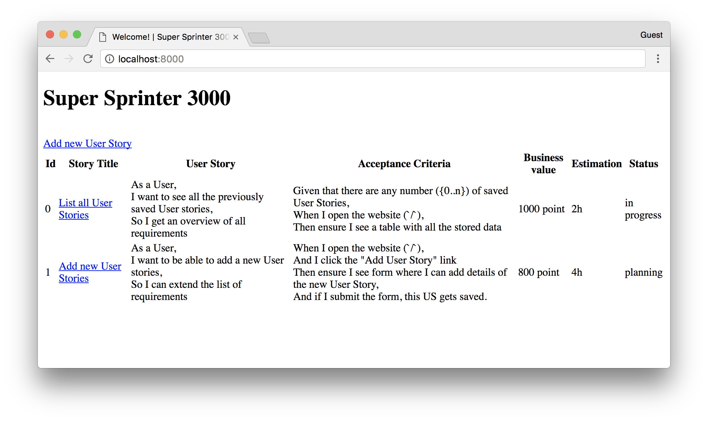

# Super Sprinter 3000

An Agile development helper software.


## Before development

To install all the *pip* dependencies, run the following command:
```
pip install -r requirements.txt
```


## Testing

To tests your work, you can run the provided acceptance tests.

How? [Go into it's folder](./test)

# Super Sprinter 3000

## Story

In this assignment, your task is to build a simple web application to help
teams track their progress during a project. The teams work in an agile system.
You will learn about agile development later on, for now, understanding
the following concepts is enough.

- **User story description**: A natural language description or story from
  the perspective of a user of the system. For example: "As a \<persona\>, I
  want \<what?\> so that \<why?\>"
- **Acceptance Criteria**: A set of statements, each with a clear
  pass/fail result, that specify both functional and non-functional
  requirements.
- **Business value**: A numerical value that represents the importance of
  the User Story for the business (that is, the customer).
- **Estimation**: A summary of the expected amount of work in all tasks
  required to achieve the User Story.
- **Status**: The current state of the User Story development cycle.

Your system must be able to list, create, and update User Stories.

## What are you going to learn?

 - Create a Flask project.
 - Use routes with Flask.
 - Use HTML and the Jinja templating engine.
 - Persist data using CSV files.


## Tasks

1. List all User Stories on the opening page.
    - The opening page of the website (`/`) shows all data of the saved user stories.
    - The page has an HTML `<table>` element containing all the data.
    - The columns of the table are "Id", "Story Title", "User Story", "Acceptance Criteria", "Business Value", "Estimation", and "Status".
    - The column titles are proper table headers.
    - There is an "Add a new User Story" link on the top of the page, pointing to the `/story` page.
    - The Story titles are links, pointing to the `/story/<id>` page where the User Story can be updated.
    - The page follows this basic design: 
    

2. It is possible to add a new User Story through a web form on page `/story`.
    - The `/story` page shows an empty web form.
    - The form has an input field for all User Story fields except for `id` and `status`.
    - The following form validation rules are applied.
- Story Title: single line text input, required, minimum 5 characters
- User Story: multiline text input, required
- Acceptance Criteria: multiline text input, required
- Business value: single line number input, only allows values dividable by 100, between 100 and 1500
- Estimation: single line number input, only allows values dividable by 0.5, between 0.5 and 40

    - Clicking the "Add new User Story" button results in the form submitting the data that gets saved.
    - When a new User Story is saved, a unique `id` is generated for it.
    - The page follows this basic design: )

3. It is possible to update an existing User Story through a web form on page `/story/<id>`.
    - The `/story/<id>` page shows the same web form as on the "Add new" page but filled in with data of the given User Story.
    - The form has an input field for all the User Story fields except `id`.
    - The following form validation rules are applied.
- Story Title: single line text input, required, minimum 5 characters
- User Story: multiline text input, required
- Acceptance Criteria: multiline text input, required
- Business value: single line number input, only allows values dividable by 100, between 100 and 1500
- Estimation: single line number input, only allows values dividable by 0.5, between 0.5 and 40

    - The "Status" field also appears as a dropdown value list, with options `planning`, `todo`, `in progress`, `review`, `done`.
 The current status of the User Story is selected by default.
    - Clicking the "Update User Story" button updates the existing entry and does not create a new one.
    - The page follows this basic design: 

4. The application persists data using a `.csv` file.
    - The User Story list and the form data are loaded from a `.csv` file upon update.
    - Form data is saved to a `.csv` file.

## General requirements

None

## Hints

- You **do not** have to use CSS.
- Use the same form template file for both adding and updating User Stories.
- Use template inheritance to avoid code duplication: <http://flask.pocoo.org/docs/0.12/patterns/templateinheritance/>.
- Use the `csv` module of Python. It has a `DictReader` and a `DictWriter` function.
Use these and work with dictionaries instead of lists accordingly.


## Background materials

- <i class="far fa-exclamation"></i> [A web-framework for Python: Flask]
- <i class="far fa-book-open"></i> [Flask documentation](http://flask.palletsprojects.com/) (the Quickstart gives a good overview)
- <i class="far fa-book-open"></i> [Jinja2 documentation](https://jinja.palletsprojects.com/en/2.10.x/templates/)
- [Tips & Tricks]
- [About unique identifiers]
